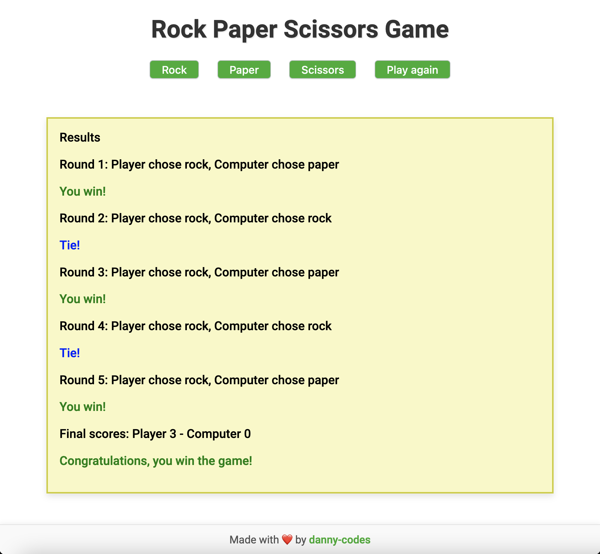
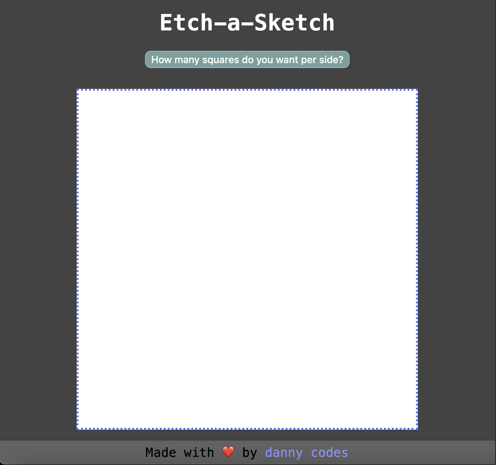
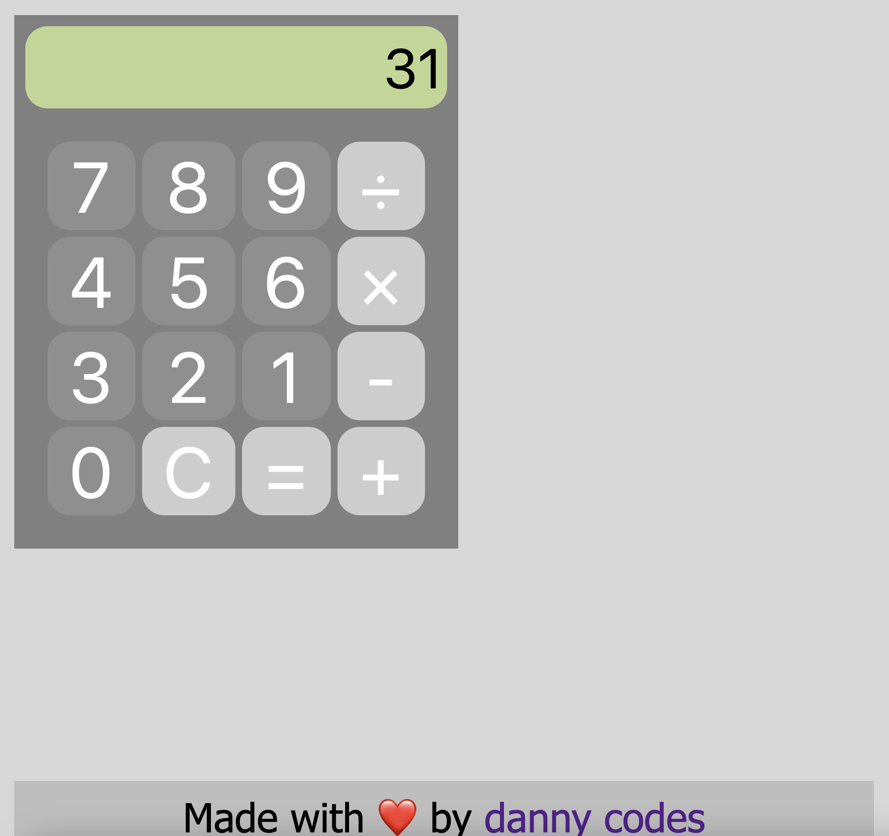

# FoundationsJS

This repository contains my solutions and exercises from the **JavaScript Foundations** course of [The Odin Project](https://www.theodinproject.com/paths/foundations/courses/foundations#javascript-basics). It's a collection of various JavaScript exercises aimed at building foundational skills for web development.

## 📘 About this Repository

This repository contains **my solutions, mini-projects, and exercises** from the **JavaScript Foundations** section of [The Odin Project](https://www.theodinproject.com/paths/foundations/courses/foundations#javascript-basics).

It serves as a **progress log and practice ground** for building strong JavaScript fundamentals while learning clean coding habits, DOM manipulation, and practical problem-solving.

---

### Projects Live Preview:
- [Rock Paper Scissors Game](https://danny-codes.github.io/FoundationsJS/rock-paper-scissors/index.html)
- [Etch-a-Sketch Project](https://danny-codes.github.io/FoundationsJS/etch-a-sketch/index.html)
- [Calculator](https://danny-codes.github.io/FoundationsJS/calculator/index.html)

<h3 align="left">Languages practiced/learned</h3>
<p align="left"> <a href="https://www.w3schools.com/css/" target="_blank" rel="noreferrer">  </a> <a href="https://www.w3.org/html/" target="_blank" rel="noreferrer">  </a> <a href="https://developer.mozilla.org/en-US/docs/Web/JavaScript" target="_blank" rel="noreferrer">  </a> </p>

## Screenshots & Descriptions

### Rock Paper Scissors Game

Console-based Rock Paper Scissors game.

- Random computer choice with Math.random().
- Human player inputs choice via prompt.
- Tracks and displays scores over 5 rounds.
- Reinforces control flow, functions, and basic game logic.
    


[Rock Paper Scissors Game Link](https://danny-codes.github.io/FoundationsJS/rock-paper-scissors/index.html)

---

### Etch-a-Sketch

A pixel drawing app inspired by the classic toy.

- Dynamically generates a customizable grid using JavaScript.
- Adds color-changing hover effects with mouse events.
- Allows users to set grid size with input prompts.
- Practices DOM manipulation and CSS Flexbox layout.



[Etch-A-Sketch Link](https://danny-codes.github.io/FoundationsJS/etch-a-sketch/index.html)

---

### Calculator

An on-screen calculator that performs basic arithmetic operations.

- Implements functions for addition, subtraction, multiplication, and division.
- Manages user inputs and operator logic without using eval().
- Features decimal input, clear button, and error handling (e.g., divide by zero).
- Focuses on state management and UI updating.



[Calculator Link](https://danny-codes.github.io/FoundationsJS/calculator/index.html)

---

## 📚 What I Learned

Through completing the JavaScript Foundations course, I practiced:

- Understanding and working with **data types** and **conditionals**.
- Writing and using **functions** with parameters and return values.
- Using **arrays** and **loops** to process and manipulate data.
- Applying **problem-solving** skills to break down and solve programming challenges.
- Practicing **clean code principles** for readable, maintainable code.
- Using **developer tools** for debugging and testing JavaScript.
- Manipulating the **DOM** to dynamically create and update page content.
- Handling **user interactions** with **event listeners** for interactivity.
- Building small **JavaScript projects** that combine these skills, including Rock Paper Scissors, Etch-a-Sketch, and Calculator apps.

These exercises helped me build a solid foundation in JavaScript and DOM manipulation while improving my problem-solving approach.

---

### Purpose:
This repo is for my personal practice as I work through the foundational topics in JavaScript. The goal is to solidify my understanding of the concepts, improve my coding skills, and eventually tackle more complex projects.

---

## 📦 Next Steps

After completing these foundational projects, I continued building more advanced projects in **The Odin Project Full Stack JavaScript** course.

➡️ Check out those projects here: [FullStackJS Projects Repository](https://github.com/danny-codes/TheOdinProjectRepo)

---

### How to Run the Project Locally:
1. Clone this repository:
   ```bash
   git clone https://github.com/danny-codes/FoundationsJS.git
